# 营销话术智能体 — 智能话术配置管理 用户操作手册

> **适用页面**：`http://localhost:8000/znhs-gray/SkillManager`（智能话术配置管理）
> **阅读对象**：技术支撑、运营人员
> **更新说明**：本手册依据最新页面设计更新——编辑界面统一为「接口配置 / 话术模板」两个 Tab；接口数据来源默认推荐「透传模式」；创建新配置与用户手册二级页均提供「返回上一级」按钮。

---

## 目录

1. [背景与人群](#一背景与人群)
2. [配置前准备](#二配置前准备)
3. [页面总览](#三页面总览)
4. [创建智能话术配置流程](#四创建智能话术配置流程)
5. [配置智能话术配置](#五配置智能话术配置)
6. [测试验证](#六测试验证)
7. [发布上线](#七发布上线)
8. [实际例子：北京套餐推荐](#八实际例子北京套餐推荐)
9. [技术原理简述](#九技术原理简述)
10. [对外接口说明](#十对外接口说明)
11. [附录](#十一附录)

---

## 一、背景与人群

### 1.1 背景

营销话术智能体通过 **“配置驱动 + 大模型生成”**，将各省接口数据标准化后生成个性化营销话术。

- 一个「智能话术配置」= 省份 + 业务意图
- 无需改代码，配置发布后即可上线

### 1.2 面向人群

| 人群 | 职责 |
|------|------|
| 技术支撑 | 提供接口文档、排查接口问题、部署运维 |
| 运营人员 | 在管理页配置智能话术配置、话术模板、测试发布 |

> **权限说明**：在鉴权模式下，账号只能编辑其所属省份的配置；其它省份的配置为「查看」只读，不能编辑。本部账号拥有全部省份权限。

---

## 二、配置前准备

数据有两种来源，二选一即可：

- **透传模式（推荐）**：调用方（CTI / 坐席系统）已持有用户/产品数据，直接放在请求的 `extra_info` 字段传入，本服务不再调外部接口。无需接口文档，配置最简单。
- **接口查询模式**：由本服务调用外部接口获取数据，需要提供接口文档。

### 2.1 准备接口文档（仅接口查询模式需要）

至少需要一个核心接口，返回：

- `current_package`：当前套餐
- `recommended_packages`：推荐产品列表

接口文档需包含：接口名称、URL、请求方式、请求参数、**成功响应示例 JSON**。

### 2.2 准备话术文案

话术内容格式：固定文案 + `{变量}` 占位符。

示例：

```text
您好！您当前套餐为{cur_brief}，根据您近6个月使用情况{usage_line}。
我为您推荐{pkg_brief}套餐，{diff_str}。
```

### 2.3 话术模板字段

| 字段 | 必填 | 说明 |
|------|------|------|
| 模板名称 | 是 | 如「套餐推荐」 |
| 应用环节 | 是 | 如 `切入环节` / `推荐环节` |
| 应用场景 | 否 | 如 `流量超套` |
| 产品 ID | 否 | 留空 = 兜底模板 |
| 话术内容 | 是 | 含 `{变量}` 占位符 |
| 关联变量 | 按需 | 勾选话术中用到的变量（系统会自动推荐） |
| 状态 | 是 | `online` / `offline` |

---

## 三、页面总览

访问地址：

```
http://localhost:8000/znhs-gray/SkillManager
```

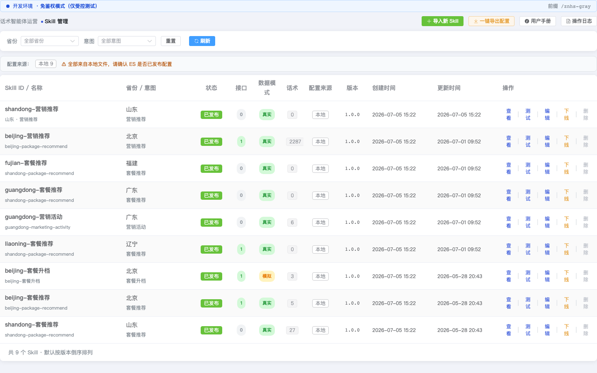

页面组成：

- **顶部操作区**：`创建新配置`、`用户手册`（生产免鉴权模式下还有 `一键导出配置`、`操作日志`）
- **筛选栏**：按省份、意图筛选；重置、刷新
- **配置来源汇总**：显示运行时配置来自 ES / Redis / 本地文件的数量，一目了然
- **配置列表**：展示所有配置的状态、接口数、话术数、配置来源、操作按钮

列表主要列：

| 列 | 说明 |
|----|------|
| 配置 ID / 名称 | 唯一标识（`省份-意图`）与显示名称 |
| 省份 / 意图 | 中文省份与业务意图 |
| 状态 | 编辑中 / 已发布 / 已下线 |
| 接口 | 已配置接口节点数 |
| 话术 | 话术模板数 |
| 配置来源 | ES / Redis / 本地 |
| 创建时间 / 更新时间 | 时间戳 |

操作按钮：

| 按钮 | 功能 |
|------|------|
| 测试 | 打开测试弹窗验证话术 |
| 编辑 | 配置接口、映射、话术模板（仅本省可编辑） |
| 查看 | 其它省份配置只读查看详情 |
| 发布 / 下线 | 已发布显示「下线」，否则显示「发布」 |
| 删除 | 删除配置（已发布需先下线） |

---

## 四、创建智能话术配置流程

### 4.1 进入创建页面

点击顶部 **「创建新配置」**：

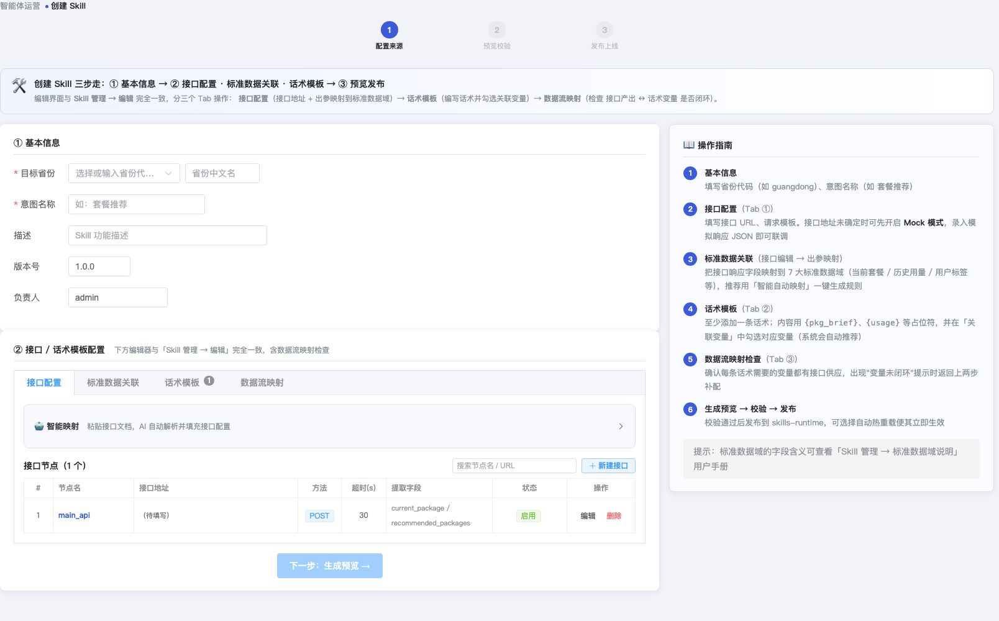

> 该二级页左上角提供 **「返回上一级」** 按钮，可随时回到管理列表。

### 4.2 填写基本信息

| 字段 | 填写说明 |
|------|---------|
| 目标省份 | 覆盖全国 31 省，下拉选择（不可手动输入）；非本部账号锁定为本省 |
| 意图名称 | 如 `套餐推荐` |
| 描述 / 版本 / 负责人 | 按需填写 |

### 4.3 配置接口与话术

填写完省份、意图后进入编辑器，与「编辑」界面完全一致，包含两个 Tab：

1. **接口配置**
2. **话术模板**

### 4.4 生成预览 → 校验 → 发布

点击 **「下一步：生成预览 →」**，校验通过后发布。

---

## 五、配置智能话术配置

在管理列表点击 **「编辑」**，打开编辑弹窗，共两个 Tab：**接口配置**、**话术模板**。

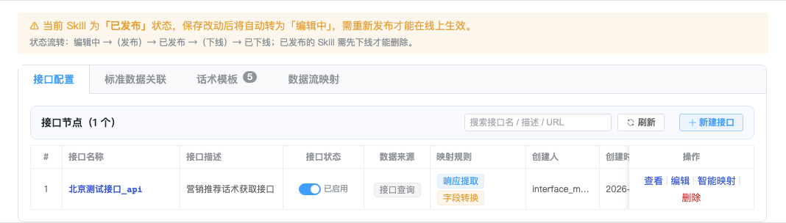

### 5.1 接口配置

#### 5.1.1 接口列表

「接口配置」Tab 展示已配置的接口节点，每行操作：**映射结果 | 编辑 | 智能映射 | 删除**。

- **映射结果**：查看该接口经映射后写入的 7 大标准数据域取值
- **智能映射**：粘贴响应样例，AI 自动生成映射规则

#### 5.1.2 新建接口

点击 **「+ 新建接口」** 进入三步编辑弹窗（手动填写）。

#### 5.1.3 选择数据来源

第①步选择数据来源，**默认「透传模式」（第一选择，推荐）**：

| 模式 | 说明 | 何时使用 |
|------|------|---------|
| **透传模式（extra_info）· 推荐** | 不调外部接口，调用方直接在 `extra_info` 传入数据，按映射规则写入标准域；若不配映射，`extra_info` 顶层与标准域同名的 key 自动透传 | 调用方已持有数据（首选） |
| 接口查询模式 | 由本服务调外部接口获取数据 | 需要服务实时查询外部系统 |

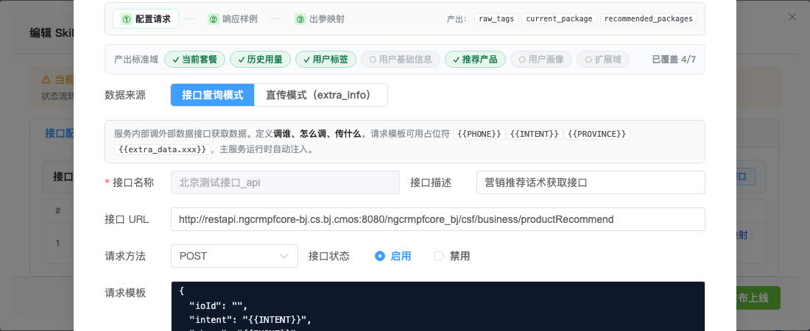

#### 5.1.4 透传模式：两步配置

- **第①步 基本信息**：节点名称、描述、直传样例（用于预览映射结果）
- **第②步 域映射**：把 `extra_info` 字段映射到 7 大标准数据域

#### 5.1.5 接口查询模式：三步配置

- **第①步 配置请求**：接口名称、URL、请求方法、请求模板（支持 `{{PHONE}}`、`{{INTENT}}`、`{{PROVINCE}}`、`{{extra_data.xxx}}` 占位符）；接口未就绪时可开启「模拟」开关，录入 Mock 响应
- **第②步 响应样例**：粘贴成功响应 JSON

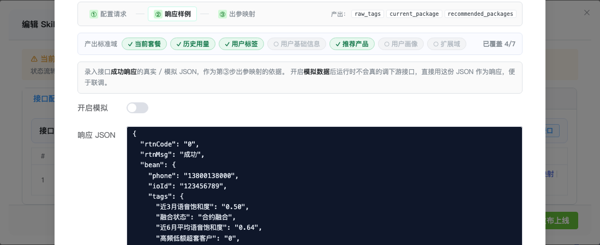

- **第③步 出参映射**：把响应字段映射到标准数据域

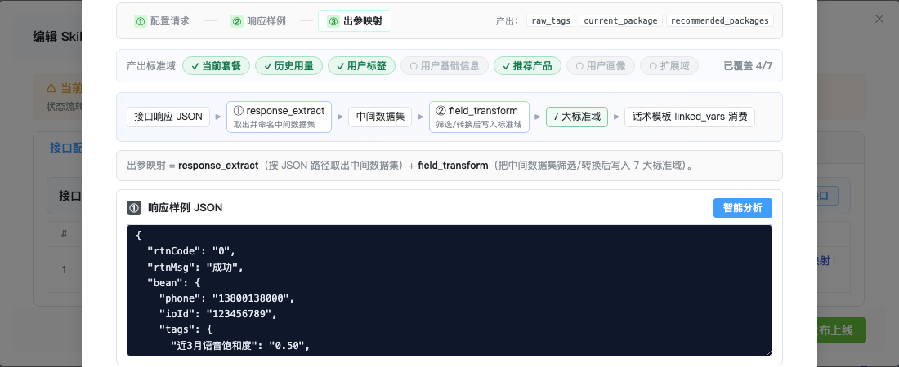

映射分两步：

| 步骤 | 作用 |
|------|------|
| `response_extract` | 按 JSON 路径整块取数（可选，简单 1:1 映射可跳过） |
| `field_transform` | 字段筛选（保留/排除）、单位换算后写入标准域 |

`response_extract` 示例：

```json
{
  "raw_tags": "bean.tags",
  "current_package": "bean.mainoffer",
  "recommended_packages": "bean.recommend_results"
}
```

`field_transform` 示例：

```json
{
  "usage.data_usage": {
    "from": "raw_tags",
    "type": "filter_include",
    "include_keys": ["近3月平均流量(MB)", "近6月平均流量(MB)"],
    "unit_convert": {
      "近3月平均流量(MB)": "mb_to_gb"
    }
  },
  "tags": {
    "from": "raw_tags",
    "type": "filter_exclude",
    "exclude_keys": ["近3月平均流量(MB)", "近6月平均流量(MB)"]
  }
}
```

#### 5.1.6 智能自动映射

点击接口的 **「智能映射」**：

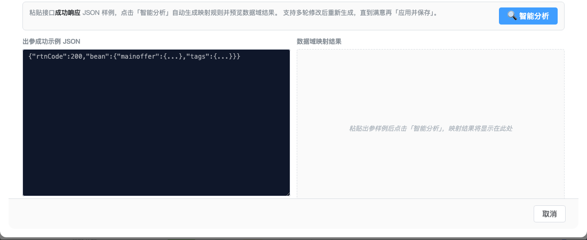

粘贴响应 JSON 并点击 **「智能分析」**：

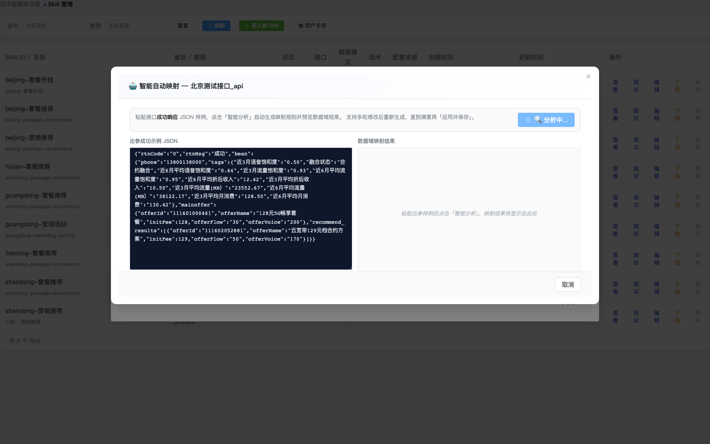

系统自动生成映射规则，检查右侧数据域结果后点击 **「应用并保存」**。

> 每个接口的映射结果可随时通过接口列表的 **「映射结果」** 按钮查看，无需切换其它 Tab。

### 5.2 话术模板

点击 **「话术模板」** Tab：

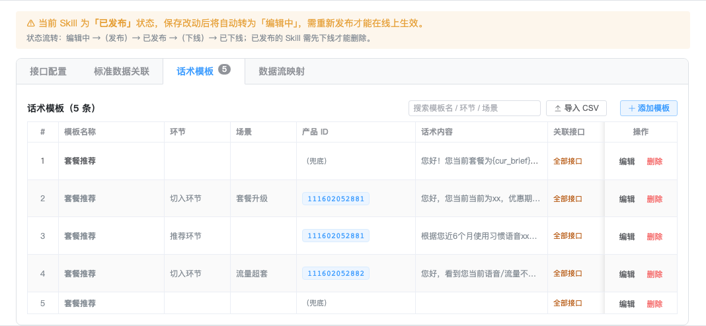

#### 5.2.1 添加模板

点击 **「+ 添加模板」**：

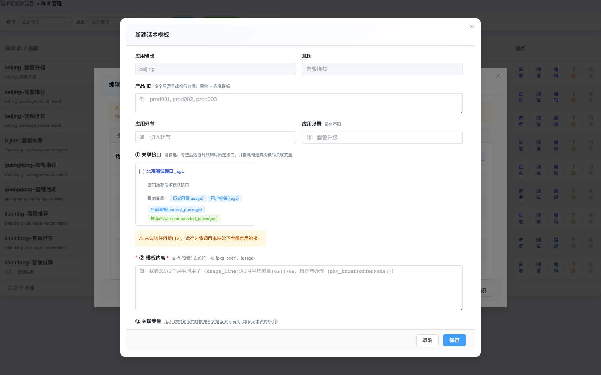

填写基础信息：

| 字段 | 说明 |
|------|------|
| 产品 ID | 多个用逗号/换行分隔；留空 = 兜底 |
| 应用环节 | 如 `推荐环节` |
| 应用场景 | 如 `流量超套` |

> 产品 ID / 应用环节 / 应用场景 至少填写一项。

#### 5.2.2 填写模板内容

在「模板内容」中输入含 `{变量}` 的话术，可点击或拖拽上方「可映射固定域」标签快速插入占位符：

```text
您好！您当前套餐为{cur_brief}，根据您近6个月使用情况{usage_line}。
我为您推荐{pkg_brief}套餐，{diff_str}。
```

#### 5.2.3 话术要求（可选预设）

「话术要求」提供 `标准` / `精简` / `严谨合规` 预设，一键套用，减少手动输入。

#### 5.2.4 关联变量

系统检测到占位符后会自动推荐并勾选对应变量：

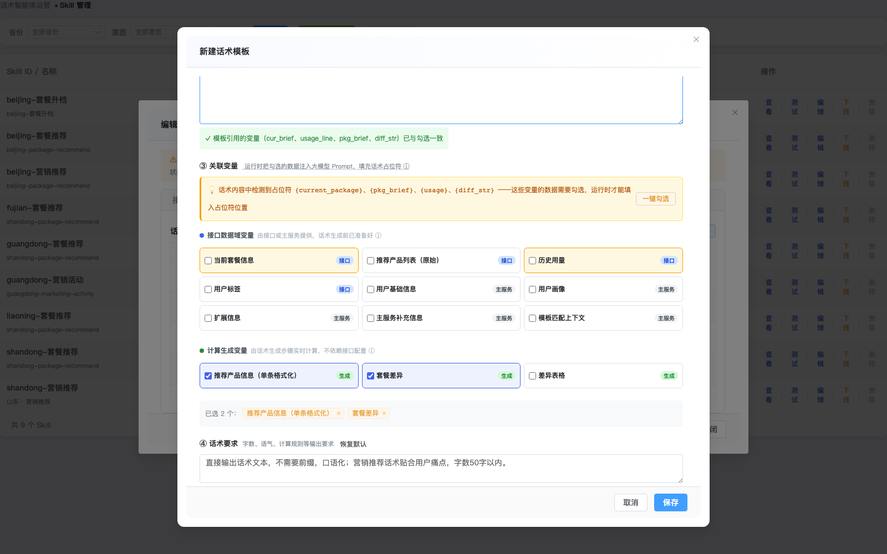

高级关联变量微调默认折叠在 **「高级：关联变量微调」** 中，一般无需展开。

#### 5.2.5 常用变量

| 变量 | 来源 |
|------|------|
| `cur_brief` | 当前套餐 |
| `pkg_brief` | 推荐产品 |
| `diff_str` | 套餐差异（系统计算） |
| `usage_line` | 历史用量 |
| `user_tags` | 用户标签 |
| `table` | 差异表格（仅前端展示，不打入大模型） |

#### 5.2.6 CSV 批量导入

点击 **「导入 CSV」** 可批量导入话术模板，列顺序：`模板名称, 应用环节, 应用场景, 产品ID, 话术内容, 关联变量, 状态`。导入为追加，不覆盖已有模板。

---

## 六、测试验证

### 6.1 打开测试弹窗

在管理列表点击 **「测试」**：

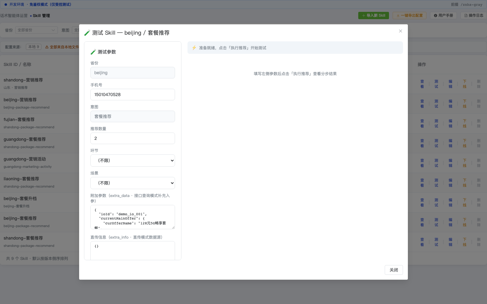

> 点击 **「智能填充测试参数」**，系统会依据该配置（透传样例 / 接口入参占位符）自动生成一组可用参数，核对后即可执行。

### 6.2 执行推荐

填写手机号等参数，点击 **「执行推荐」**：

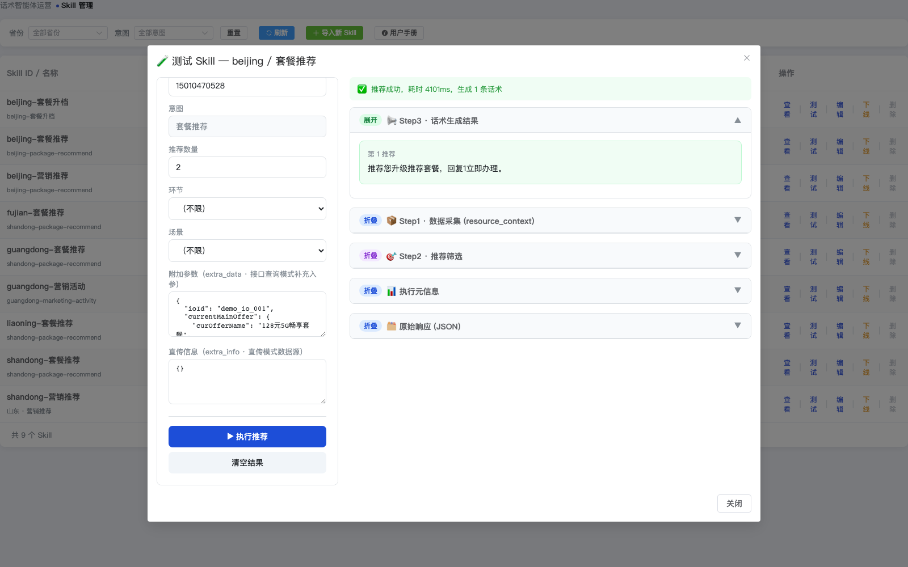

结果包含：

- Step3：生成的话术
- Step1：数据采集结果
- Step2：推荐产品
- 执行元信息 / 原始响应

### 6.3 判断配置成功

| 检查项 | 标准 |
|--------|------|
| 接口调用 | 状态条显示「推荐成功」 |
| 数据采集 | Step1 中各标准域有值 |
| 推荐产品 | Step2 中有推荐结果 |
| 话术生成 | Step3 中话术不为空且变量已替换 |

---

## 七、发布上线

### 7.1 发布

在管理列表点击 **「发布」**：

- 选择是否覆盖已有同名配置
- 选择是否发布后热重载
- 点击确认发布，发布后配置进入「已发布」状态，可被话术调度引擎调用

### 7.2 下线与删除

- **下线**：已发布配置点击「下线」；下线后配置不再被调度
- **删除**：已发布的配置不可直接删除，需先下线，再点击「删除」

### 7.3 状态流转

```
编辑中 →（发布）→ 已发布 →（下线）→ 已下线 →（删除）
```

> 已发布的配置保存任何改动会自动转回「编辑中」，需重新发布才能在线上生效。

---

## 八、实际例子：北京套餐推荐

### 8.1 配置信息

| 字段 | 值 |
|------|-----|
| 省份 | `beijing` |
| 意图 | `套餐推荐` |
| 数据来源 | 接口查询模式（Mock 联调） |

### 8.2 接口配置

接口 `北京测试接口_api` 核心配置：

```json
{
  "url": "http://host/api/recommend",
  "method": "POST",
  "request_template": {
    "phone": "{{PHONE}}",
    "intent": "{{INTENT}}"
  },
  "response_extract": {
    "raw_tags": "bean.tags",
    "current_package": "bean.mainoffer",
    "recommended_packages": "bean.recommend_results"
  },
  "field_transform": {
    "usage.data_usage": {
      "from": "raw_tags",
      "type": "filter_include",
      "include_keys": ["近3月平均流量(MB）", "近6月平均流量(MB）"],
      "unit_convert": { "近3月平均流量(MB）": "mb_to_gb" }
    },
    "tags": {
      "from": "raw_tags",
      "type": "filter_exclude",
      "exclude_keys": ["近3月平均流量(MB）", "近6月平均流量(MB）"]
    }
  }
}
```

### 8.3 话术模板

```json
{
  "template_name": "套餐推荐",
  "template_content": "您好！您当前套餐为{cur_brief}，根据您近6个月通信消费和使用情况{usage_line}。我为您推荐{pkg_brief}套餐，{diff_str}。",
  "linked_vars": ["current_package", "usage", "pkg_brief", "diff_str"],
  "status": "online"
}
```

### 8.4 测试结果

使用测试弹窗执行后，可看到推荐成功并生成话术：


---

## 九、技术原理简述

```
POST /marketing/recommend
    ↓
智能话术配置运行时（province + intent）
    ↓
MarketingPipeline 三步管道
    ├── Step1 DataStep：调接口 / 读 extra_info → 映射到 7 大标准域
    ├── Step2 RecommendStep：筛选 TopN 推荐产品
    └── Step3 ScriptStep：匹配模板 → LLM 生成话术
```

---

## 十、对外接口说明

### 10.1 实时推荐主接口

```
POST /znhs/marketing/recommend
```

#### 入参

| 字段 | 必填 | 说明 |
|------|------|------|
| phone | 是 | 手机号 |
| intent | 是 | 业务意图 |
| province | 是 | 省份代码（如 `beijing`；广东可传数字编码 `200`，服务端自动转 `guangdong`） |
| topN | 否 | 推荐数量，默认 3 |
| extra_data | 否 | 接口查询补充入参 |
| extra_info | 否 | 透传模式数据源 |
| batch_contexts | 否 | 话术生成上下文列表（产品/环节/场景） |

#### 入参示例（接口查询模式）

```json
{
  "phone": "15010470528",
  "intent": "套餐推荐",
  "province": "beijing",
  "topN": 2,
  "extra_data": {
    "currentMainOffer": {
      "curOfferName": "128元5G畅享套餐",
      "curOfferId": "111601000461"
    }
  }
}
```

#### 入参示例（透传模式）

```json
{
  "phone": "15010470528",
  "intent": "营销活动",
  "province": "200",
  "topN": 1,
  "extra_info": {
    "current_package": { "package_name": "59元套餐", "actual_price": "59" },
    "final_recommendations": {
      "recommend_package_name": "广东99元大流量包",
      "recommend_actual_price": "99",
      "recommend_base_flow": "50",
      "recommend_preferential_period": "6"
    }
  },
  "batch_contexts": [
    { "product_id": "流量", "stage": "个人市场", "scence": "开口话术" }
  ]
}
```

#### 出参

| 字段 | 说明 |
|------|------|
| code | 200 成功 |
| data.recommend_results | 推荐结果 + 生成话术 |
| other_info | 原始响应 / 元信息 |

#### 出参示例

```json
{
  "code": 200,
  "data": {
    "recommend_results": [
      {
        "product_id": "111602052881",
        "rank": 1,
        "marketing_text": "您好！您当前套餐为128元5G畅享套餐...",
        "diff_table": { "headers": [], "rows": [] }
      }
    ]
  }
}
```

### 10.2 常见错误码

| 状态码 | 含义 | 处理 |
|--------|------|------|
| 404 | 未找到配置 | 检查 province/intent，确认已发布 |
| 500 | 内部异常 | 检查接口配置、映射、LLM 服务 |
| 504 | 接口超时 | 检查外部接口或调大 timeout |

---

## 十一、附录

### 11.1 环境模式

| 模式 | 鉴权 | 外部接口 | URL 前缀 | 启动命令 |
|------|------|---------|---------|---------|
| development | 关 | mock | /znhs-gray | `python main.py` |
| gray | 开 | 真实 | /znhs-gray | `LINGYUN_ENV=gray python main.py` |
| production | 开 | 真实 | /znhs | `LINGYUN_ENV=production python main.py` |
| production_noauth | 关 | 真实 | /znhs-gray | `LINGYUN_ENV=production_noauth python main.py` |

> `production_noauth`：生产行为（读 ES / Redis、调真实接口）但关闭灵运鉴权，便于在生产环境验证页面与配置。

### 11.2 常见问题

**Q：话术中变量为空？**
A：检查接口是否返回字段 → 出参映射是否写入标准域 → 话术模板是否勾选变量。可用接口列表的「映射结果」核对标准域取值。

**Q：上线后未生效？**
A：确认发布时勾选了「发布后热重载」，或手动调用 `/api/skills/reload`。

**Q：无法删除配置？**
A：已发布配置需先下线再删除。

**Q：只能查看不能编辑其它省份？**
A：鉴权模式下账号只能编辑本省配置，其它省份为只读。如需跨省操作请使用本部账号。
